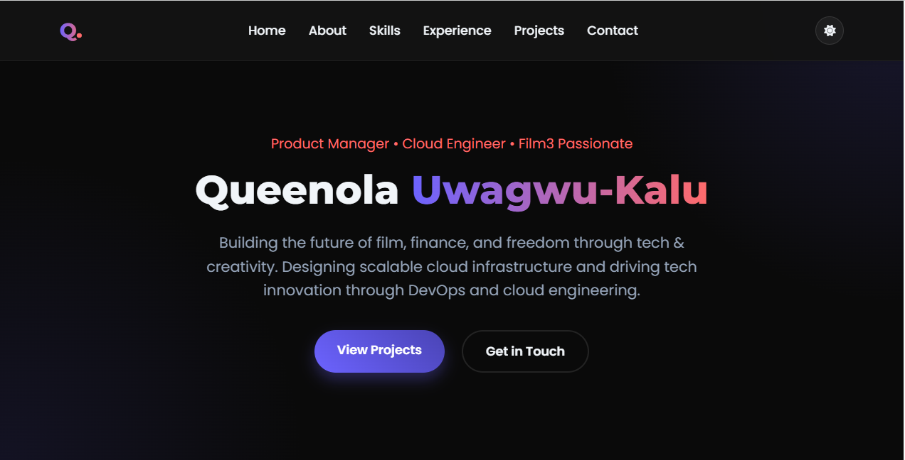

# 🚀 Exam Project Deployment - Metavision Showcase

**Project Title**: Personal Page

**Description**: Web Hosting Stack Deployment with DuckDNS & Nginx/Node JS Reverse Proxy
**Author**: Queenola Uwagwu-Kalu (Cloud Engineer | Web3 Builder)

**Live Demo**:
🌐 [http://queenola.duckdns.org](http://queenola.duckdns.org)
📡 Public IP: `108.129.134.33`

🔗 GitHub Repository: [https://github.com/queenola/metavision-deploy](https://github.com/queenola/metavision-deploy)

📸 

---

## 🔍 Overview

This project demonstrates the deployment of a static website using **Node.js** and **Express**, behind an **Nginx reverse proxy**, accessible via a custom **DuckDNS** domain on an **Ubuntu EC2 instance**. It includes basic firewall hardening, dynamic IP handling, and optional SSL setup.

---

## 🛠️ Technical Stack & Versions

| Component  | Version   | Purpose                    |
| ---------- | --------- | -------------------------- |
| Ubuntu OS  | 22.04 LTS | Operating System           |
| Node.js    | v18.x     | JavaScript Runtime         |
| Nginx      | 1.18.0    | Reverse Proxy & Web Server |
| DuckDNS    | N/A       | Dynamic DNS                |
| PM2        | 5.x       | Node.js Process Management |
| Express.js | 4.18.2    | Web Server Framework       |

---

## 📋 Prerequisites

* AWS EC2 instance (Ubuntu 22.04 LTS)
* DuckDNS subdomain & token
* SSH key pair
* Node.js & npm installed on the server
* `git` and `curl` installed

---

## 🚀 Deployment Steps

### 1. Provision EC2 Instance

* Launch Ubuntu 22.04 EC2 (t2.micro)
* Open ports: 22 (SSH), 80 (HTTP)

### 2. Connect via SSH

```bash
ssh -i ~/keys/first-key.pem ubuntu@108.129.134.33
```

### 3. Initial Setup

```bash
sudo apt update && sudo apt upgrade -y
sudo apt install nodejs npm nginx curl git -y
```

### 4. Setup DuckDNS

```bash
mkdir ~/duckdns
nano ~/duckdns/duck.sh
```

**duck.sh**:

```bash
echo url="https://www.duckdns.org/update?domains=queenola&token=YOUR_TOKEN&ip=" | curl -k -o ~/duckdns/duck.log -K -
```

```bash
chmod 700 ~/duckdns/duck.sh
(crontab -l ; echo "*/5 * * * * ~/duckdns/duck.sh >/dev/null 2>&1") | crontab -
```

### 5. Clone & Configure App

```bash
git clone https://github.com/queenola/metavision-deploy.git
cd metavision-deploy
npm install
```

### 6. Run App with PM2

```bash
sudo npm install -g pm2
pm2 start myappserver.js --name metavision-app
pm2 save
pm2 startup
```

### 7. Configure Nginx

```bash
sudo nano /etc/nginx/sites-available/myapp
```

**Nginx Config**:

```nginx
server {
    listen 80;
    server_name queenola.duckdns.org;

    location / {
        proxy_pass http://localhost:3000;
        proxy_http_version 1.1;
        proxy_set_header Upgrade $http_upgrade;
        proxy_set_header Connection 'upgrade';
        proxy_set_header Host $host;
        proxy_cache_bypass $http_upgrade;
    }
}
```

```bash
sudo ln -s /etc/nginx/sites-available/myapp /etc/nginx/sites-enabled/
sudo rm /etc/nginx/sites-enabled/default
sudo nginx -t && sudo systemctl reload nginx
```

---

## 📁 Application Structure

```
metavision-deploy/
├── myappserver.js         # Node.js Express server
├── public/
│   ├── index.html         # Main site
│   ├── styles.css         # Site styling
│   └── assets/
│       └── queenola.jpg   # Example image
└── duckdns/
    └── duck.sh            # Dynamic DNS script
```

---

## ✨ Key Features

* 🧭 Static website served from `/public`
* 🌐 DuckDNS domain with IP auto-update
* 🔀 Nginx reverse proxy to Node.js
* 🧠 Clean file separation
* 🔧 Easily customizable stack

---

## 🧪 Testing & Verification

```bash
# Check if app is running
pm2 list
curl http://localhost:3000

# Visit: http://queenola.duckdns.org
```

---

## 🔮 Future Enhancements

* HTTPS with Certbot
* Contact form (NodeMailer)
* Logging & monitoring with PM2 + logrotate
* TailwindCSS integration

---

## 👩🏽‍💻 Author

**Queenola Uwagwu-Kalu**
Cloud | Web3 | Product | Film

📧 Email: [queenolakalu@gmail.com](mailto:queenolakalu@gmail.com)
🔗 Site: [http://queenola.duckdns.org](http://queenola.duckdns.org)

---
## 🔗 References

* [DuckDNS](https://www.duckdns.org/)
* [NGINX Docs](https://nginx.org/en/docs/)
* [PM2 Documentation](https://pm2.keymetrics.io/)
* [Express.js Guide](https://expressjs.com/)
* [AWS EC2 Docs](https://docs.aws.amazon.com/ec2/index.html)
* [Let's Encrypt / Certbot](https://certbot.eff.org/)

---

## 📜 License

MIT License

*Last Updated: June 12, 2025
